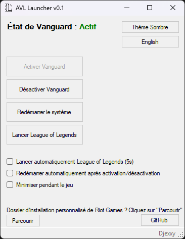
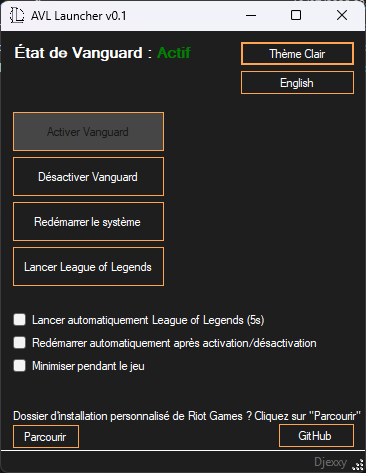
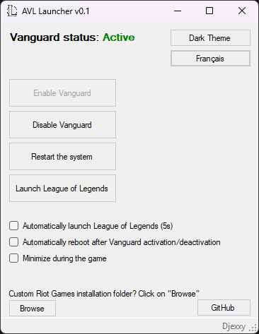
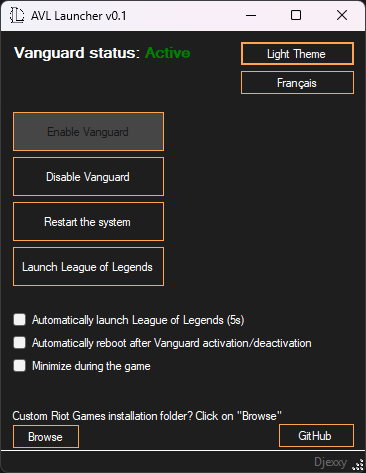

# AVL Launcher v0.1

---

## Screenshots

---

## Description (FR)

**AVL Launcher** est une application Windows légère conçue pour gérer le service anti-triche Riot Vanguard (VGK) et lancer *League of Legends* facilement.  
Elle permet d’activer/désactiver Vanguard, de redémarrer le système si nécessaire, et de lancer automatiquement *League of Legends* avec suivi et options pour minimiser le launcher pendant le jeu.

---

## Fonctionnalités

- Affichage de l’état de Vanguard avec indication colorée  
- Activation ou désactivation du service Vanguard (`vgk` et `vgc`)  
- Invitation au redémarrage après modification (paramétrable)  
- Lancement automatique de League of Legends avec les bons arguments  
- Option de lancement automatique 5 secondes après le démarrage du launcher si Vanguard est actif  
- Minimisation du launcher pendant le jeu et restauration après fermeture  
- Interface bilingue (français / anglais), commutable à chaud  
- Parcours du dossier d’installation personnalisé de Riot Games  

---

## Installation

Placez le dossier à l'emplacement de votre choix, vous pouvez ensuite lancer AVL Launcher.exe.

---

## Utilisation

- Utilisez les boutons **Activer Vanguard** et **Désactiver Vanguard** pour gérer le service anti-triche.  
- Le launcher proposera de redémarrer le système si configuré après modification de Vanguard.  
- Cliquez sur **Lancer League of Legends** pour démarrer le jeu avec les bons paramètres.  
- Si l’option de lancement automatique est activée, le jeu se lancera 5 secondes après le démarrage du launcher si Vanguard est actif.  
- Changez la langue via le bouton prévu à cet effet.  
- Si vous fermez le launcher alors que Vanguard est actif, une invite vous proposera de le désactiver pour ne pas le laisser actif involontairement.

---

## Prérequis

- Windows 10 ou supérieur  
- .NET Framework 4.7.2 ou supérieur  
- Droits administrateur pour modifier les services système  

---

## Licence

Ce projet est licencié sous la Licence Publique Générale GNU version 3.0 (GPL-3.0) - voir le fichier LICENSE pour les détails.

---

## Contact / Support

GitHub : https://github.com/Djexxy

---

## Remarques

Ce logiciel est fourni "tel quel", sans garantie. À utiliser à vos risques et périls. Usage personnel uniquement, dans le respect des conditions d’utilisation de Riot Games.

---

# AVL Launcher v0.1

---

## Description (EN)

**AVL Launcher** is a lightweight Windows application designed to manage Riot Vanguard (VGK) anti-cheat service and launch *League of Legends* conveniently.  
It allows you to enable/disable Vanguard, reboot the system if needed, and automatically launch and monitor League of Legends with options to minimize the launcher during gameplay.

---

## Features

- Check Vanguard status and display it with color-coded indicator  
- Enable or disable Vanguard service (`vgk` and `vgc`)  
- Prompt for system reboot when changing Vanguard state (configurable)  
- Automatically launch League of Legends with proper arguments  
- Option to auto-launch League of Legends after startup if Vanguard is active  
- Option to minimize launcher during gameplay and restore after exit  
- Multilingual interface: English and French, toggleable at runtime  
- Browse custom Riot Games installation folder  

---

## Installation

Place the folder wherever you want, then you can run AVL Launcher.exe.

---

## Usage

- Use **Enable Vanguard** and **Disable Vanguard** buttons to control the anti-cheat service.  
- If configured, the launcher will prompt to reboot the system after enabling or disabling Vanguard.  
- Click **Launch League of Legends** to start the game via RiotClientServices.exe with correct launch parameters.  
- If **Auto-launch** is enabled, the game will launch automatically 5 seconds after launcher startup if Vanguard is active.  
- Use language toggle button to switch between English and French.  
- When closing the launcher while Vanguard is active, you will be prompted to disable it to avoid leaving it running unintentionally.

---

## Requirements

- Windows 10 or later  
- .NET Framework 4.7.2 or later  
- Administrative rights to modify system services  

---

## License

This project is licensed under the GNU General Public License v3.0 (GPL-3.0) - see the LICENSE file for details.

---

## Contact / Support

GitHub: https://github.com/Djexxy  

---

## Notes

This software is provided "as-is" without warranty. Use at your own risk. It is intended for personal use only and should comply with Riot Games’ terms of service.
